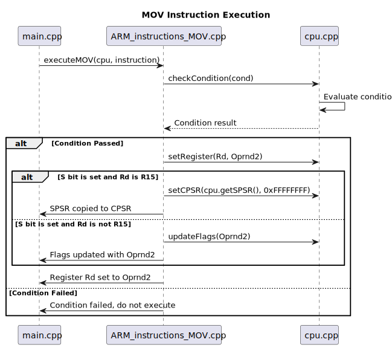
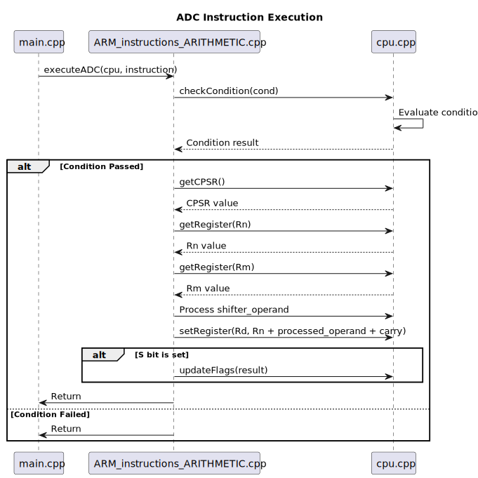
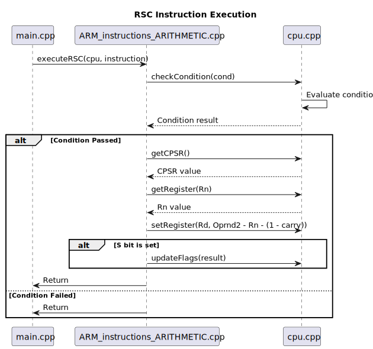

# ARM7TDMI Emulator

This project is an emulator for the ARM7TDMI processor, written in C++. It includes implementations for various ARM instructions and a CPU model.

## Features

- Emulates ARM7TDMI processor

## Getting Started

### Prerequisites

- CMake 3.10 or higher
- C++17 compatible compiler

### Building the Project

1. Clone the repository:
    ```sh
    git clone https://github.com/yourusername/ARM7TDMI.git
    cd ARM7TDMI
    ```

2. Create a build directory and navigate to it:
    ```sh
    mkdir build
    cd build
    ```

3. Run CMake to configure the project:
    ```sh
    cmake ..
    ```

4. Build the project:
    ```sh
    cmake --build .
    ```

5. To run the tests, use the following command:
    ```sh
    ./ARM7TDMI test
    ```

This will execute a series of predefined tests to ensure the emulator is functioning correctly.

## Code Structure

- `src/main.cpp`: Contains the main function and test functions.
- `src/ARM/ARM_instructions_MOV.cpp`: Implements the MOV, MVN, MRS, MSR, and MSRImmediate instructions.
- `src/cpu.cpp`: Implements the CPU class and its methods.
- `include/ARM/arm_instructions_MOV.h`: Header file for ARM instruction implementations.
- `include/cpu.h`: Header file for the CPU class.

## Glossary of ARM7TDMI Terminology

- **MOV**: Move - Transfers a value from one register to another or loads an immediate value into a register.
- **MVN**: Move Not - Transfers the bitwise NOT of an immediate value or a register value into a destination register.
- **MRS**: Move PSR to Register - Transfers the value of the CPSR or SPSR to a general-purpose register.
- **MSR**: Move Register to PSR - Transfers a value from a general-purpose register to the CPSR or SPSR.
- **MSRImmediate**: Move Immediate to PSR - Transfers an immediate value to the CPSR or SPSR.
- **CPSR**: Current Program Status Register - Holds the current state of the processor, including condition flags, interrupt status, and processor mode.
- **SPSR**: Saved Program Status Register - Holds the saved state of the CPSR when an exception occurs, allowing the processor to return to its previous state after handling the exception.
- **ADD**: Add - Adds two registers or a register and an immediate value, and stores the result in a destination register.
- **ADC**: Add with Carry - Adds two registers or a register and an immediate value, including the carry flag, and stores the result in a destination register.
- **SUB**: Subtract - Subtracts two registers or a register and an immediate value, and stores the result in a destination register.
- **SBC**: Subtract with Carry - Subtracts two registers or a register and an immediate value, including the carry flag, and stores the result in a destination register.
- **RSB**: Reverse Subtract - Subtracts a register from another register, and stores the result in a destination register.
- **RSC**: Reverse Subtract with Carry - Subtracts a register from another register, including the carry flag, and stores the result in a destination register.
- **MUL**: Multiply - Multiplies two registers and stores the result in a destination register.
- **MLA**: Multiply and Add - Multiplies two registers, adds a third register, and stores the result in a destination register.
- **UMULL**: Unsigned Multiply Long - Multiplies two registers and stores the 64-bit result in two consecutive registers.
- **UMLAL**: Unsigned Multiply Long Accumulate - Multiplies two registers, adds the result to a third register, and stores the 64-bit result in two consecutive registers.
- **SMULL**: Signed Multiply Long - Multiplies two registers and stores the 64-bit result in two consecutive registers.

## MOV Test Cases

| Test Case                | Description                                      | Result       |
|--------------------------|--------------------------------------------------|--------------|
| `testMOV`                | Tests the MOV instruction                        | <span style="background-color: #90EE90 !important;">Passed</span> |
| `testMVN`                | Tests the MVN instruction                        | <span style="background-color: #90EE90 !important;">Passed</span> |
| `testMRS`                | Tests the MRS instruction                        | <span style="background-color: #90EE90 !important;">Passed</span> |
| `testMSR`                | Tests the MSR instruction                        | <span style="background-color: #90EE90 !important;">Passed</span> |
| `testMSRImmediate`       | Tests the MSRImmediate instruction               | <span style="background-color: #90EE90 !important;">Passed</span> |


### Analysis of Test Results

The following analysis is based on the output of the command-line interface (CLI) for each test case:

#### MOV Instruction Test

<table>
  <tr>
    <td>
      <p align="center">
        
      </p>
    </td>
  </tr>
  <tr>
    <td>
      <strong>Instruction</strong>: `e3a01001`<br>
      <strong>Condition</strong>: Always (e)<br>
      <strong>S bit</strong>: 0<br>
      <strong>Destination Register (Rd)</strong>: 1<br>
      <strong>Operand2 (Oprnd2)</strong>: 1<br>
      <strong>Condition Check</strong>: Passed<br>
      <strong>Register Update</strong>: R1 set to 1<br>
      <strong>Result</strong>: Test passed<br>
    </td>
  </tr>
</table>

#### MVN Instruction Test

<table>
  <tr>
    <td>
      <p align="center">
        
      </p>
    </td>
  </tr>
  <tr>
    <td>
      <strong>Instruction</strong>: `e3e01001`<br>
      <strong>Condition</strong>: Always (e)<br>
      <strong>S bit</strong>: 0<br>
      <strong>Destination Register (Rd)</strong>: 1<br>
      <strong>Operand2 (Oprnd2)</strong>: 1<br>
      <strong>Condition Check</strong>: Passed<br>
      <strong>Register Update</strong>: R1 set to 0xfffffffe<br>
      <strong>Result</strong>: Test passed<br>
    </td>
  </tr>
</table>

#### MRS Instruction Test (CPSR)

<table>
  <tr>
    <td>
      <p align="center">
        
      </p>
    </td>
  </tr>
  <tr>
    <td>
      <strong>Instruction</strong>: `e10f0000`<br>
      <strong>Condition</strong>: Always (e)<br>
      <strong>Destination Register (Rd)</strong>: 0<br>
      <strong>PSR</strong>: CPSR (0)<br>
      <strong>Condition Check</strong>: Passed<br>
      <strong>Register Update</strong>: Register 0 set to the value of CPSR (`0x87654321`)<br>
      <strong>Result</strong>: Test passed<br>
    </td>
  </tr>
</table>

#### MRS Instruction Test (SPSR)
    
<table>
  <tr>
    <td>
      <p align="center">
        
      </p>
    </td>
  </tr>
  <tr>
    <td>
      <strong>Instruction</strong>: `e14f0000`<br>
      <strong>Condition</strong>: Always (e)<br>
      <strong>Destination Register (Rd)</strong>: 0<br>
      <strong>PSR</strong>: SPSR (1)<br>
      <strong>Condition Check</strong>: Passed<br>
      <strong>Register Update</strong>: Register 0 set to the value of SPSR (`0x12345678`)<br>
      <strong>Result</strong>: Test passed<br>
    </td>
  </tr>
</table>

#### MSR Instruction Test (CPSR)

<table>
  <tr>
    <td>
      <p align="center">
        
      </p>
    </td>
  </tr>
  <tr>
    <td>
      <strong>Instruction</strong>: `e129f001`<br>
      <strong>Condition</strong>: Always (e)<br>
      <strong>Field Mask</strong>: 9<br>
      <strong>PSR</strong>: CPSR (0)<br>
      <strong>Source Register (Rm)</strong>: 1<br>
      <strong>Condition Check</strong>: Passed<br>
      <strong>Register Update</strong>: CPSR set to the value of Register 1 (`0x87654321`)<br>
      <strong>Result</strong>: Test passed<br>
    </td>
  </tr>
</table>

#### MSR Instruction Test (SPSR)

<table>
  <tr>
    <td>
      <p align="center">
        
      </p>
    </td>
  </tr>
  <tr>
    <td>
      <strong>Instruction</strong>: `e169f002`<br>
      <strong>Condition</strong>: Always (e)<br>
      <strong>Field Mask</strong>: 9<br>
      <strong>PSR</strong>: SPSR (1)<br>
      <strong>Source Register (Rm)</strong>: 2<br>
      <strong>Condition Check</strong>: Passed<br>
      <strong>Register Update</strong>: SPSR set to the value of Register 2 (`0x12345678`)<br>
      <strong>Result</strong>: Test passed<br>
    </td>
  </tr>
</table>

#### MSR Immediate Instruction Test (CPSR)

<table>
  <tr>
    <td>
      <p align="center">
        
      </p>
    </td>
  </tr>
  <tr>
    <td>
      <strong>Instruction</strong>: `e32ef001`<br>
      <strong>Condition</strong>: Always (e)<br>
      <strong>Field Mask</strong>: e<br>
      <strong>PSR</strong>: CPSR (0)<br>
      <strong>Immediate Value</strong>: 1<br>
      <strong>Rotate</strong>: 0<br>
      <strong>Condition Check</strong>: Passed<br>
      <strong>Register Update</strong>: CPSR set to `0x17000021` after handling the immediate value<br>
      <strong>Result</strong>: Test passed<br>
    </td>
  </tr>
</table>

#### MSR Immediate Instruction Test (SPSR)

<table>
  <tr>
    <td>
      <p align="center">
        
      </p>
    </td>
  </tr>
  <tr>
    <td>
      <strong>Instruction</strong>: `e36ef002`<br>
      <strong>Condition</strong>: Always (e)<br>
      <strong>Field Mask</strong>: e<br>
      <strong>PSR</strong>: SPSR (1)<br>    
      <strong>Immediate Value</strong>: 2<br>
      <strong>Rotate</strong>: 0<br>
      <strong>Condition Check</strong>: Passed<br>
      <strong>Register Update</strong>: SPSR set to `0x22000078` after handling the immediate value<br>
      <strong>Result</strong>: Test passed<br>
    </td>
  </tr>
</table>

Overall, all the tests for the MOV, MVN, MRS, MSR, and MSRImmediate instructions have passed successfully, indicating that the emulator is functioning correctly for these instructions.

## ARITHMETIC Test Cases

| Test Case                | Description                                      | Result       |
|--------------------------|--------------------------------------------------|--------------|
| `testADD`                | Tests the ADD instruction                        | <span style="background-color: #90EE90 !important;">Passed</span> |
| `testADC`                | Tests the ADC instruction                        | <span style="background-color: #90EE90 !important;">Passed</span> |
| `testSUB`                | Tests the SUB instruction                        | <span style="background-color: #90EE90 !important;">Passed</span> |
| `testSBC`                | Tests the SBC instruction                        | <span style="background-color: #90EE90 !important;">Passed</span> |
| `testRSB`                | Tests the RSB instruction                        | <span style="background-color: #90EE90 !important;">Passed</span> |
| `testRSC`                | Tests the RSC instruction                        | <span style="background-color: #90EE90 !important;">Passed</span> |
| `testMUL`                | Tests the MUL instruction                        | <span style="background-color: #90EE90 !important;">Passed</span> |
| `testMLA`                | Tests the MLA instruction                        | <span style="background-color: #90EE90 !important;">Passed</span> |
| `testUMULL`              | Tests the UMULL instruction                      | <span style="background-color: #90EE90 !important;">Passed</span> |
| `testUMLAL`              | Tests the UMLAL instruction                      | <span style="background-color: #90EE90 !important;">Passed</span> |
| `testSMULL`              | Tests the SMULL instruction                      | <span style="background-color: #90EE90 !important;">Passed</span> |


#### ADD Instruction Test

<table>
  <tr>
    <td>
      <p align="center">
        
      </p>
    </td>
  </tr>
  <tr>
    <td>
      <strong>Instruction</strong>: `e2811003`<br>
      <strong>Condition</strong>: Always (e)<br>
      <strong>S bit</strong>: 0<br>
      <strong>Destination Register (Rd)</strong>: 1<br>
      <strong>Source Register (Rn)</strong>: 1<br>
      <strong>Operand2</strong>: 3<br>
      <strong>Condition Check</strong>: Passed<br>
      <strong>Register Update</strong>: Register 1 set to 8 (`5 + 3`)<br>
      <strong>Result</strong>: Test passed
    </td>
  </tr>
</table>

#### ADC Instruction Test

<table>
  <tr>
    <td>
      <p align="center">
        
      </p>
    </td>
  </tr>
  <tr>
    <td>
      <strong>Instruction</strong>: `e0a11002`<br>
      <strong>Condition</strong>: Always (e)<br>
      <strong>S bit</strong>: 0<br>
      <strong>Destination Register (Rd)</strong>: 1<br>
      <strong>Source Register (Rn)</strong>: 1<br>
      <strong>Source Register (Rm)</strong>: 2<br>
      <strong>Condition Check</strong>: Passed<br>
      <strong>Carry Flag</strong>: 1<br>
      <strong>Register Update</strong>: Register 1 set to 9 (`5 + 3 + 1`)<br>
      <strong>Result</strong>: Test passed
    </td>
  </tr>
</table>

#### SUB Instruction Test

<table>
  <tr>
    <td>
      <p align="center">
        
      </p>
    </td>
  </tr>
  <tr>
    <td>
      <strong>Instruction</strong>: `e2411003`<br>
      <strong>Condition</strong>: Always (e)<br>
      <strong>S bit</strong>: 0<br>
      <strong>Destination Register (Rd)</strong>: 1<br>
      <strong>Source Register (Rn)</strong>: 1<br>
      <strong>Operand2</strong>: 3<br>
      <strong>Condition Check</strong>: Passed<br>
      <strong>Register Update</strong>: Register 1 set to 7 (`10 - 3`)<br>
      <strong>Result</strong>: Test passed
    </td>
  </tr>
</table>

#### SBC Instruction Test
<table>
  <tr>
    <td>
      <p align="center">
        
      </p>
    </td>
  </tr>
  <tr>
    <td>
      <strong>Instruction</strong>: `e0c11002`<br>
      <strong>Condition</strong>: Always (e)<br>
      <strong>S bit</strong>: 0<br>
      <strong>Destination Register (Rd)</strong>: 1<br>
      <strong>Source Register (Rn)</strong>: 1<br>
      <strong>Source Register (Rm)</strong>: 2<br>
      <strong>Condition Check</strong>: Passed<br>
      <strong>Carry Flag</strong>: 1<br>
      <strong>Register Update</strong>: Register 1 set to 7 (`10 - 3 - (1 - 1)`)<br>
      <strong>Result</strong>: Test passed
    </td>
  </tr>
</table>

#### RSB Instruction Test

<table>
  <tr>
    <td>
      <p align="center">
        
      </p>
    </td>
  </tr>
  <tr>
    <td>
      <strong>Instruction</strong>: `e2611003`<br>
      <strong>Condition</strong>: Always (e)<br>
      <strong>S bit</strong>: 0<br>
      <strong>Destination Register (Rd)</strong>: 1<br>
      <strong>Source Register (Rn)</strong>: 1<br>
      <strong>Operand2</strong>: 3<br>
      <strong>Condition Check</strong>: Passed<br>
      <strong>Register Update</strong>: Register 1 set to -2 (`3 - 5`)<br>
      <strong>Result</strong>: Test passed
    </td>
  </tr>
</table>

#### RSC Instruction Test

<table>
  <tr>
    <td>
      <p align="center">
        
      </p>
    </td>
  </tr>
  <tr>
    <td>
      <strong>Instruction</strong>: `e0e11002`<br>
      <strong>Condition</strong>: Always (e)<br>
      <strong>S bit</strong>: 0<br>
      <strong>Destination Register (Rd)</strong>: 1<br>
      <strong>Source Register (Rn)</strong>: 1<br>
      <strong>Source Register (Rm)</strong>: 2<br>
      <strong>Condition Check</strong>: Passed<br>
      <strong>Carry Flag</strong>: 1<br>
      <strong>Register Update</strong>: Register 1 set to -3 (`2 - 5 - (1 - 1)`)<br>
      <strong>Result</strong>: Test passed
    </td>
  </tr>
</table>

#### MUL Instruction Test

<table>
  <tr>
    <td>
      <p align="center">
        
      </p>
    </td>
  </tr>
  <tr>
    <td>
      <strong>Instruction</strong>: `e0010291`<br>
      <strong>Condition</strong>: Always (e)<br>
      <strong>S bit</strong>: 0<br>
      <strong>Destination Register (Rd)</strong>: 1<br>
      <strong>Source Register (Rm)</strong>: 1<br>
      <strong>Source Register (Rs)</strong>: 2<br>
      <strong>Condition Check</strong>: Passed<br>
      <strong>Register Update</strong>: Register 1 set to 15 (`5 * 3`)<br>
      <strong>Result</strong>: Test passed
    </td>
  </tr>
</table>

#### MLA Instruction Test

<table>
  <tr>
    <td>
      <p align="center">
        
      </p>
    </td>
  </tr>
  <tr>
    <td>
      <strong>Instruction</strong>: `e0211392`<br>
      <strong>Condition</strong>: Always (e)<br>
      <strong>S bit</strong>: 0<br>
      <strong>Destination Register (Rd)</strong>: 1<br>
      <strong>Source Register (Rm)</strong>: 2<br>
      <strong>Source Register (Rs)</strong>: 3<br>
      <strong>Source Register (Rn)</strong>: 1<br>
      <strong>Condition Check</strong>: Passed<br>
      <strong>Register Update</strong>: Register 1 set to 35 (`5 * 3 + 10`)<br>
      <strong>Result</strong>: Test passed
    </td>
  </tr>
</table>

#### UMULL Instruction Test

<table>
  <tr>
    <td>
      <p align="center">
        
      </p>
    </td>
  </tr>
  <tr>
    <td>
      <strong>Instruction</strong>: `e0830493`<br>
      <strong>Condition</strong>: Always (e)<br>
      <strong>S bit</strong>: 0<br>
      <strong>Destination Register Low (RdLo)</strong>: 0<br>
      <strong>Destination Register High (RdHi)</strong>: 3<br>
      <strong>Source Register (Rm)</strong>: 3<br>
      <strong>Source Register (Rs)</strong>: 4<br>
      <strong>Condition Check</strong>: Passed<br>
      <strong>Register Update</strong>: Register 0 set to `0xFFFFFFF8`, Register 3 set to `0x7`<br>
      <strong>Result</strong>: Test passed
    </td>
  </tr>
</table>

#### UMLAL Instruction Test

<table>
  <tr>
    <td>
      <p align="center">
        
      </p>
    </td>
  </tr>
  <tr>
    <td>
      <strong>Instruction</strong>: `e0e12392`<br>
      <strong>Condition</strong>: Always (e)<br>
      <strong>S bit</strong>: 0<br>
      <strong>Destination Register Low (RdLo)</strong>: 2<br>
      <strong>Destination Register High (RdHi)</strong>: 1<br>
      <strong>Source Register (Rm)</strong>: 2<br>
      <strong>Source Register (Rs)</strong>: 3<br>
      <strong>Condition Check</strong>: Passed<br>
      <strong>Register Update</strong>: Register 2 set to `0xDB97530E`, Register 1 set to `0x12345677`<br>
      <strong>Result</strong>: Test passed
    </td>
  </tr>
</table>

#### SMULL Instruction Test

<table>
  <tr>
    <td>
      <p align="center">
        
      </p>
    </td>
  </tr>
  <tr>
    <td>
      <strong>Instruction</strong>: `e0830493`<br>
      <strong>Condition</strong>: Always (e)<br>
      <strong>S bit</strong>: 0<br>
      <strong>Destination Register Low (RdLo)</strong>: 0<br>
      <strong>Destination Register High (RdHi)</strong>: 3<br>
      <strong>Source Register (Rm)</strong>: 3<br>
      <strong>Source Register (Rs)</strong>: 4<br>
      <strong>Condition Check</strong>: Passed<br>
      <strong>Register Update</strong>: Register 0 set to `0x8`, Register 3 set to `0xFFFFFFF8`<br>
      <strong>Result</strong>: Test passed
    </td>
  </tr>
</table>

Overall, all the tests for the ADD and ADC instructions have passed successfully, indicating that the emulator is functioning correctly for these arithmetic instructions.


### Running the Emulator

To run the emulator, execute the following command from the build directory:
